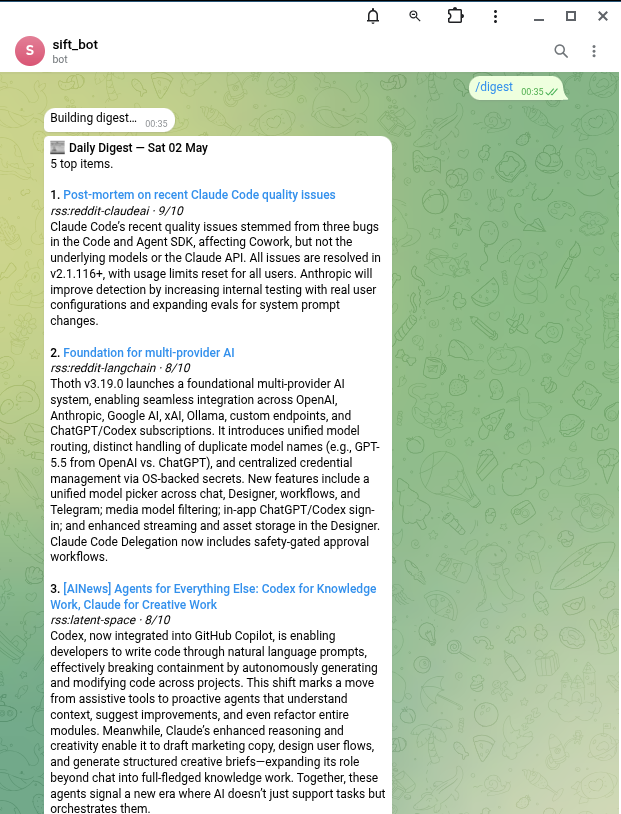

# sift

> Self-hosted personal news agent. You pick the topics and sources; a local LLM filters the firehose down to what's relevant; a daily Telegram digest delivers it.

<table>
  <tr>
    <td valign="top" width="48%">
      
      <p align="center"><sub><b>Setup wizard</b> — describe what you follow, the local LLM drafts a <code>preferences.yaml</code></sub></p>
    </td>
    <td valign="top" width="52%">
      
      <p align="center"><sub><b>Daily digest in Telegram</b> — top scored articles, one batched message</sub></p>
    </td>
  </tr>
</table>

## Features

- **Local-first.** Runs as one Python process against a local LLM (Ollama / LM Studio / llama.cpp / MLX-LM). Hosted APIs work too if you want — OpenAI-compatible endpoints are interchangeable.
- **Digest mode, not live push.** Articles are scored + summarised continuously and stashed; one batched message lands at your configured time (default 09:00 local). Trigger sooner with `/digest`, page the backlog with `/more`.
- **Seven source kinds out of the box.** RSS / Atom (Substack, YouTube channels, Lobsters tags, anything feedparser handles), Hacker News, Reddit, Bluesky, GitHub releases, arXiv search, Mastodon. Add your own as a 50-line `Source` subclass.
- **Conversational config.** Tell the bot *"lower the threshold to 6"* or *"mute funding announcements"* in chat — it classifies the intent, previews the diff, and only mutates after you tap Confirm. `/undo` reverts.
- **LLM-drafted preferences.** First-time setup lets you describe what you follow in plain language; the just-configured model writes your `preferences.yaml`, runs a per-source pre-flight (404'd subreddits, missing creds, dead RSS URLs), and offers to auto-disable failures before save.
- **Multi-user-lite.** A flat allowlist of chat IDs shares one feed — partner, friends, family. Friends who want their own knobs self-host.

## Why

Can't keep up with the fields you actually care about? Same. So I built this: a bot that watches your trusted sources, scores each article against your stated interests with a local LLM, and ships one Telegram digest a day. One message instead of forty open tabs.

Single Python process, single SQLite file. Runs on a workstation, your data stays yours.

## Prereqs

- **Python 3.12** + [`uv`](https://docs.astral.sh/uv/)
- **An LLM backend** — anything OpenAI-compatible. The wizard sets up one of these for you:

  | | macOS | Linux | Notes |
  |---|---|---|---|
  | **[Ollama](https://ollama.com)** | ✓ | ✓ | recommended default — auto-pulls models |
  | **[LM Studio](https://lmstudio.ai)** | ✓ | ✓ | GUI app, especially nice on macOS |
  | **[llama.cpp](https://github.com/ggml-org/llama.cpp)** (`llama-server`) | ✓ | ✓ | run any HF GGUF |
  | **[MLX-LM](https://github.com/ml-explore/mlx-lm)** | Apple Silicon only | — | native + fastest on M-series |
  | **Hosted API** (OpenRouter / Groq / Together / OpenAI / …) | ✓ | ✓ | no GPU required; great for VPS |

  Full setup details per backend in [`docs/backends.md`](docs/backends.md).

- **A Telegram bot** — DM [@BotFather](https://t.me/BotFather), `/newbot`, get a token (the wizard will validate it).
- (Optional) **[`llmfit`](https://github.com/disruptor-labs/llmfit)** — used by the Ollama branch of the wizard to read your hardware and recommend a model. Other backends don't need it.

## Setup — guided wizard

```bash
git clone https://github.com/joshrichards37/sift.git && cd sift
uv sync
uv run sift-setup
```

The wizard will:

1. **LLM backend** — pick one (Ollama / LM Studio / llama.cpp / MLX-LM / hosted). For Ollama, dynamic picker shows installed models first, then a curated remote manifest, then a "type any tag" escape hatch. Other backends prompt for URL + model and run a `/v1/models` reachability check.
2. **Telegram bot** — paste your token (validated against `getMe`), then DM the bot once and it auto-detects your chat id.
3. **Preferences** — either describe what you follow in free text and let the just-configured model draft a `preferences.yaml` (with a per-source pre-flight that flags 404s, missing creds, hallucinated handles before save), or pick a curated preset from `examples/`.

Any stage is skippable — skipped fields land in `.env` as `__TODO_<NAME>__` placeholders that `sift` startup detects and surfaces with the resume command. Re-run `sift-setup --resume <stage>` to fill them in.

Then start the agent:

```bash
uv run sift
```

DM your bot `/start` to confirm. First daily digest fires at the configured `digest_time` (default 09:00 local); `/digest` triggers one immediately.

## Setup — manual

If you'd rather skip the wizard:

```bash
git clone https://github.com/joshrichards37/sift.git && cd sift
uv sync
cp .env.example .env                                # fill in TELEGRAM_BOT_TOKEN + OWNER_CHAT_ID + LLM_*
cp examples/preferences-tech-news.yaml preferences.yaml   # or pick another preset
# bring up your LLM backend — see docs/backends.md
uv run sift
```

## Sources

Seven kinds ship; add your own by subclassing `Source` (see [Adding a source](#adding-a-source)).

| Kind | `id:` form | Notes |
|---|---|---|
| Hacker News | `hn` | Algolia search; multi-keyword queries split client-side on `OR` |
| RSS / Atom | `rss:<slug>` | Anything `feedparser` handles — Substack, YouTube channels, [Lobsters tagged feeds](https://lobste.rs/tags), most blogs |
| Reddit | `reddit:<slug>` | Public JSON API; supports `a+b+c` multi-sub feeds; `min_points` filters low-effort |
| Bluesky | `bsky:<handle>` | Author feed via `atproto`. Needs `BLUESKY_HANDLE` + `BLUESKY_APP_PASSWORD` |
| GitHub releases | `github:<slug>` | One Article per release. Anonymous = 60/h; set `GITHUB_TOKEN` for 5000/h |
| arXiv | `arxiv:<slug>` | `categories` (`cs.AI`, `cs.LG`, …) crossed with optional `query` keywords |
| Mastodon | `masto:<slug>` | Public posts from one account. Reblogs are unwrapped to the original |

Sources self-disable on permanent failures (404'd subreddit, missing Bluesky creds, hallucinated handle) so the agent's logs don't fill with the same traceback every poll.

## Presets

`examples/` ships with ready-to-use topic configurations. Copy whichever fits your interests:

| Preset | Focus |
|---|---|
| `preferences-ai-tooling.yaml` | Harness engineering, Claude Code, agent SDKs, top AI-engineering voices |
| `preferences-tech-news.yaml` | Broad tech industry — hardware, software, security, dev tools |
| `preferences-research-papers.yaml` | arXiv (cs.CL/LG/AI) + lab blogs (HuggingFace, BAIR, Lilian Weng) |
| `preferences-finance-markets.yaml` | Macro, markets, investing — analytical-blog biased (free-source only) |

Each preset is a complete `preferences.yaml` — a topics block, exclusion keywords, threshold, and curated sources. Edit anything you like; the LLM scores articles against whatever you write in `topics`.

## Commands (in Telegram)

The agent runs in **digest mode**: articles are ingested + scored + summarised continuously, but only delivered as one batched message per day (default 09:00 local) plus on-demand via `/digest` and `/more`.

| Command | What it does |
|---|---|
| `/start` | Show status + command list |
| `/digest` | Send today's digest now (top N scored articles, marks them sent) |
| `/more [N]` | Send next N from backlog (default `more_size`, max 20) |
| `/backlog` | How many scored articles are queued for the next digest |
| `/prefs` | Threshold, digest size + time, source count, current backlog |
| `/pause` | Stop outbound messages (scheduler keeps ingesting + scoring) |
| `/resume` | Re-enable outbound |
| `/recent` | List last 10 sent articles |
| `/undo` | Revert the most recent conversational config edit |
| Any text | Either chat about recent articles **or** edit config — see below |

**Free-text routing.** Anything you DM the bot that isn't a slash command is classified by the LLM:

- *"what's the latest on Claude Code?"* → chat answer using the last 20 sent articles as context.
- *"follow vLLM releases"* / *"mute funding announcements"* / *"lower the threshold to 6"* → diff preview with a Confirm/Cancel keyboard. Applied edits persist atomically; `/undo` reverts the last one.
- Source add/remove via chat needs a scheduler restart in the current version; the bot replies with a "edit `preferences.yaml` and restart" message rather than silently ignoring.

## Inviting a friend

The bot supports a small allowlist of chat IDs sharing one feed (same preferences, same backlog). To add someone:

1. **They DM your bot first** — Telegram won't let the bot message anyone who hasn't initiated contact. Send them the bot username (e.g. `@ai_sift_bot`).
2. **They send any message** — `/start` is fine. The bot replies *"You're not authorised. Send your chat id `<their-actual-numeric-id>` to the owner."* The bot fills in their real id (e.g. `876543210`); they copy that number and forward it to you.
3. **You whitelist them** — append the id to `AUTHORIZED_CHAT_IDS` in `.env` (comma-separated), then restart.
4. **They DM `/start` again** — they're in. Daily digest, `/digest`, `/more` will all reach them.

What's shared vs. private:
- **Shared (everyone sees the same)**: the daily digest, `/digest`, `/more`. One backlog: if A `/more`s 10 articles, those 10 are gone for B until next digest.
- **Private (caller-only)**: `/backlog`, `/recent`, `/prefs`, free-text chat replies.
- **Global state, any user can flip**: `/pause` and `/resume` affect outbound for everyone.

Heads-up for friends:
- Bot runs on your machine. When your laptop sleeps, the bot is offline.
- Free-text chat queries flow through whichever LLM backend you configured (local Ollama / LM Studio / hosted API). You can read them in the DB if you want — they should know.

If your group grows past ~5 active users, consider having them self-host instead (clone the repo, register their own BotFather token, bring their own LLM backend — local Ollama or a free hosted tier like Gemini Flash). Same code, no infra burden on you.

## Adding a source

1. New file in `src/sift/sources/<name>.py` subclassing `Source`. Set `self.disabled = True` and `self.disabled_reason = "..."` on permanent failures (missing creds, 404'd resource) — the scheduler exits the poll loop on the flag instead of retrying every cadence cycle.
2. Implement `async def poll() -> list[Article]`. Idempotent — caller dedups by URL.
3. Add the kind to `KNOWN_KINDS` and dispatch in `build_sources` (both in `src/sift/sources/__init__.py`).
4. Document in `preferences.example.yaml` under `sources:`; add a parse test in `tests/test_sources.py`.

## Tuning

| Symptom | Knob |
|---|---|
| Telegram floods | raise `relevance_threshold`, lower `max_per_cycle`, lengthen `cadence_seconds` |
| Missing relevant items | lower threshold, sharpen `topics` to be more specific |
| Bad summaries | edit `SUMMARY_SYSTEM` in `src/sift/llm.py`, restart |
| Too slow | switch to a smaller model (`LLM_MODEL=qwen3:8b`) and re-pull |

## Switching the LLM

Any OpenAI-compatible endpoint works. Edit the three `LLM_*` lines in `.env` and restart:

```bash
# Gemini Flash via OpenRouter (free tier)
LLM_BASE_URL=https://openrouter.ai/api/v1
LLM_API_KEY=sk-or-...
LLM_MODEL=google/gemini-2.5-flash
```

Full per-backend instructions (Ollama, LM Studio, llama.cpp, MLX-LM, OpenRouter, Groq, Together, OpenAI) in [`docs/backends.md`](docs/backends.md). Pre-existing `OLLAMA_*` env vars also still work — they're aliased for back-compat.

## Storage

SQLite at `./sift.db`. Schema in `src/sift/storage.py` (`articles`, `feedback`, `source_cursor`). Inspect with `sqlite3 sift.db`.

## Lint / format / test

```bash
uv run ruff check src/
uv run ruff format src/
uv run pytest
```

Tests live in `tests/` and stay narrow on purpose — env-var resolution, source payload parsing, LLM JSON handling, storage roundtrips, and message chunking. CI runs all three commands on every PR; branch protection on `main` requires the `lint` check to pass before merge.

## Sample systemd user unit

Drop into `~/.config/systemd/user/sift.service`:

```ini
[Unit]
Description=sift personal news agent
After=network-online.target

[Service]
Type=simple
WorkingDirectory=%h/workspace/sift
ExecStart=%h/.local/bin/uv run sift
Restart=on-failure
RestartSec=30s

[Install]
WantedBy=default.target
```

Then `systemctl --user daemon-reload && systemctl --user enable --now sift`.

## Documentation

- [`docs/backends.md`](docs/backends.md) — Ollama / LM Studio / llama.cpp / MLX-LM / hosted APIs (OpenRouter, Groq, Together, OpenAI)
- [`docs/models.md`](docs/models.md) — picking a model within a backend; quality / speed tradeoffs
- [`docs/sources.md`](docs/sources.md) — source types, cadence guidelines, writing your own
- [`docs/prompting.md`](docs/prompting.md) — how relevance + summary prompts work, tuning
- [`docs/deploy.md`](docs/deploy.md) — tmux, systemd, launchd, VPS patterns
- [`AGENTS.md`](AGENTS.md) — architecture, conventions, contributing context for AI agents (`CLAUDE.md` symlinks here)
- [`CONTRIBUTING.md`](CONTRIBUTING.md) — PR process, style, commit conventions

## License

MIT. See [`LICENSE`](LICENSE).
